# HiperFlix

# Especificação de requisitos
## PROJETO: Aplicativo para Recomendação de Filmes, Séries e Livros
### Curso de Sistemas de Informação
### Prática Profissional em Análise e Desenvolvimento de Sistemas
### Turma 05K
### 1º semestre de 2021

              UNIVERSIDADE PRESBITERIANA MACKENZIE
                      
              FACULDADE DE COMPUTAÇÃO E INFORMÁTICA

                          LETHICIA MARQUEZINI
                     JOAO PEDRO FRANCA DE OLIVEIRA

          Aplicativo para Recomendação de Filmes, Séries e Livros 
                            
                               HiperFlix

                                SÃO PAULO
                                  2021

# 1- Introdução

O presente projeto em questão foi desenvolvido com o intuito de desenvolver uma aplicação de recomendação de filmes, livros e séries. A ideia principal é que seja utilizado por uma empresa e seus colaboradores visando a promoção do desenvolvimento social, do engajamento e da sinergia entre os indivíduos e suas clusterizações dentro da instituição como um todo. O sistema utilizará os insumos gerados pelos próprios usuários para auxiliar nas avaliações, na recomendação de itens de maneira intuitiva e automática.

# 2- Requisitos do Sistema

### 2.1- Requisitos Funcionais

RF1	- O sistema deverá permitir que o colaborador da empresa faça um cadastro.

RF2	- O sistema deverá permitir que o colaborador possa atualizar as informações de cadastro.

RF3 -  O sistema deverá permitir que qualquer membro possa cadastrar novo item (livro, filme ou série).

RF4	- O sistema deverá permitir que o administrador possa validar os novos itens cadastrados.

RF5	- O sistema deverá permitir que os membros possam avaliar os itens.

RF6 - O sistema deverá permitir a pesquisa de outros membros.

RF7 - O sistema deverá permitir que os membros possam enviar solicitações de amizade para outros membros.

RF8 - O sistema deverá permitir que os membros possam aceitar ou recusar solicitações de amizade de outros membros.

RF9 - O sistema deverá permitir que os membros possam reagir ou retirar a reação nas avaliações.

RF10 - O sistema deverá permitir a visualização de amigos em comum entre os membros.

RF11 - O sistema deverá disponibilizar uma página de análise de dados para os gerentes do serviço.

### 2.2- Requisitos não Funcionais

RNF1 - O sistema poderá ser acessado web através de navegador.

RNF2 - O sistema deverá ser responsivo e leve para carregamento das funções.

RNF3 - Os dados devem ser armazenados em uma base de dados, podendo ser relacional ou NoSQL

RNF4 - Aplicação deve ser implementada em um provedor de serviços na internet.

RNF5 - O sistema não pode demorar mais do que 5 segundos para carregar uma página.

RNF6 - A disponibilidade da aplicação deverá atender o padrão 99.99%, em regime 24x7

RNF7 - A documentação do sistema deverá apresentar indicativos de segurança dos dados cadastrais e transacionais para evitar possíveis invasões ao site.

# 3- Casos de uso
## 3.1- Diagrama de casos de uso

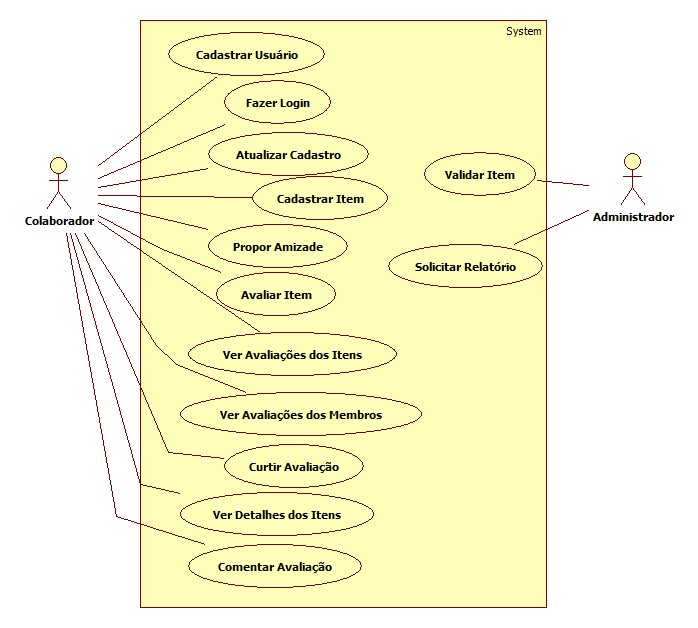

## 3.2- Especificações dos casos de uso

# 4- Navegação
## 4.1- Diagrama de Navegação

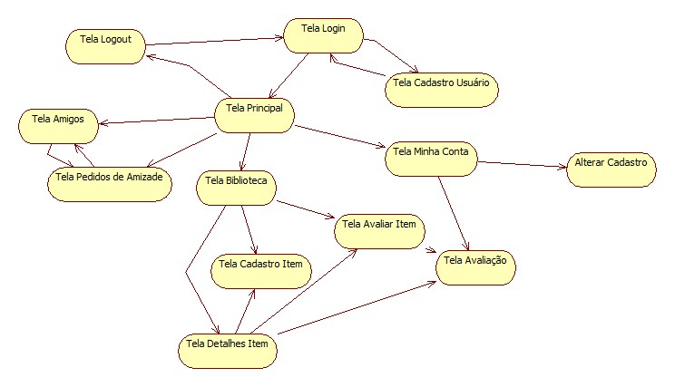

## 4.2- Wireframes
###1. Tela de Login
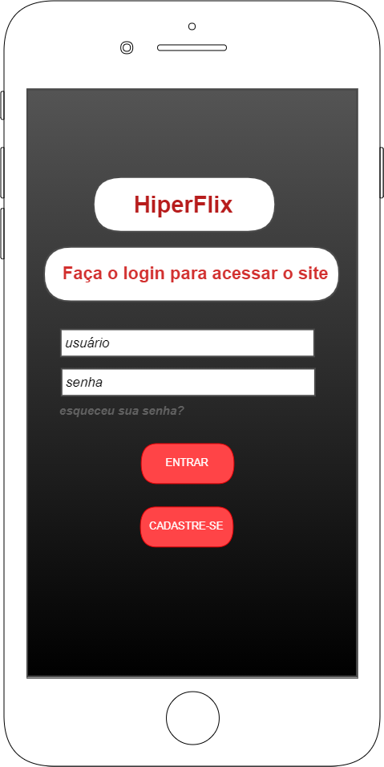
&nbsp;
&nbsp;
###2. Tela de Registro de Usuário

&nbsp;
&nbsp;
###3. Alterar Registro

&nbsp;
&nbsp;
###4. Excluir Registro

&nbsp;
&nbsp;
###5. Tela de senha/username incorretos

&nbsp;
&nbsp;
###6. Menu de opções no perfil do usuário

&nbsp;
&nbsp;
###7. Tela Principal de Cadastro

&nbsp;
&nbsp;
###8. Tela de Cadastro de Filme

&nbsp;
&nbsp;
###9. Tela de Cadastro de Serie

&nbsp;
&nbsp;
###10. Tela de Cadastro de Livro

&nbsp;
&nbsp;
###11. Tela de Cadastro Efetuado

&nbsp;
&nbsp;
###12. Tela de Cadastro de livro inválido

&nbsp;
&nbsp;
###13. Tela de Cadastro de série inválido

&nbsp;
&nbsp;
###13. Tela de Cadastro de filme inválido

&nbsp;
&nbsp;
###14. Tela de Nova Avaliação

&nbsp;
&nbsp;
###15. Tela de Reagir e Comentar Avaliações e Comentários

&nbsp;
&nbsp;
###16. Tela de Itens cadastrados a serem validados

&nbsp;
&nbsp;
###17. Tela de validar Cadastro de Item

&nbsp;
&nbsp;
###18. Tela de Procurar Amigos

&nbsp;
&nbsp;
###19. Tela de Receber recomendações

&nbsp;
&nbsp;
###20. Tela de Receber sugestões de amizades

&nbsp;
&nbsp;
###21. Tela de Busca de amigos

&nbsp;
&nbsp;
###22. Tela de de amigos

&nbsp;
&nbsp;
###23. Tela de Propor relacionamento

&nbsp;
&nbsp;
###24. Tela de avaliação excluida

&nbsp;
&nbsp;
###25. Tela de comentário excluido

&nbsp;
&nbsp;

# 5- Diagramas de Sequencias

## Fazer Login
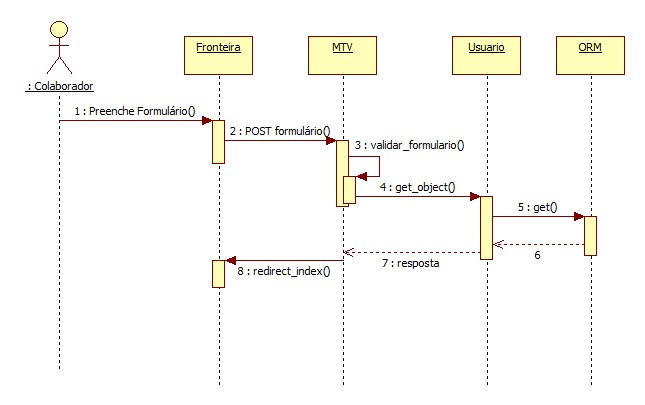

## Cadastrar Usuario
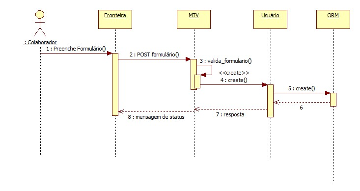

## Atualizar Cadastro
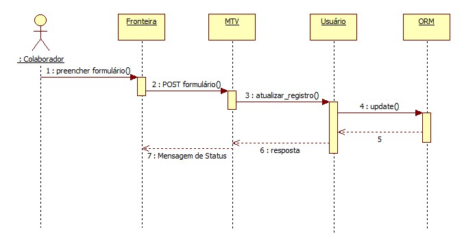

## Propor Amizade
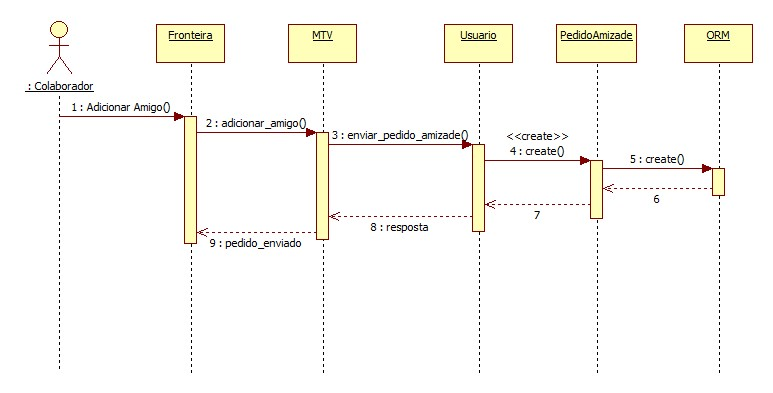

## Cadastrar Item
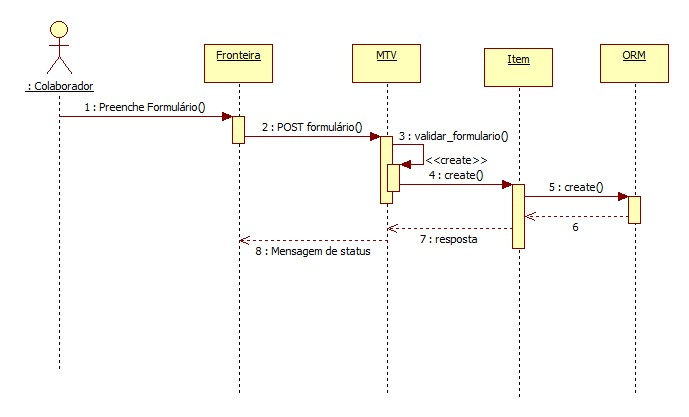

## Validar Item
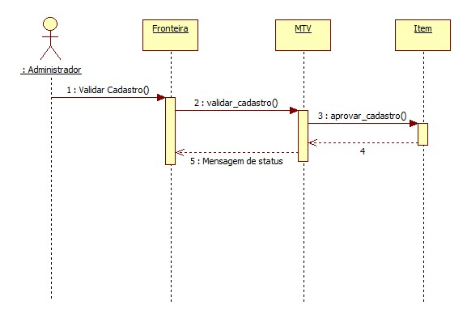

## Solicitar Relatório
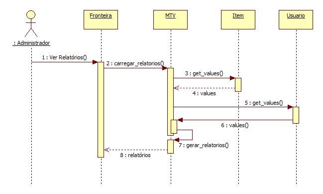

## Avaliar Item
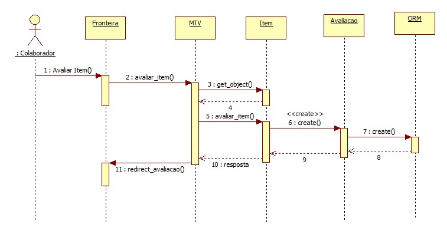

## Curtir Avaliação
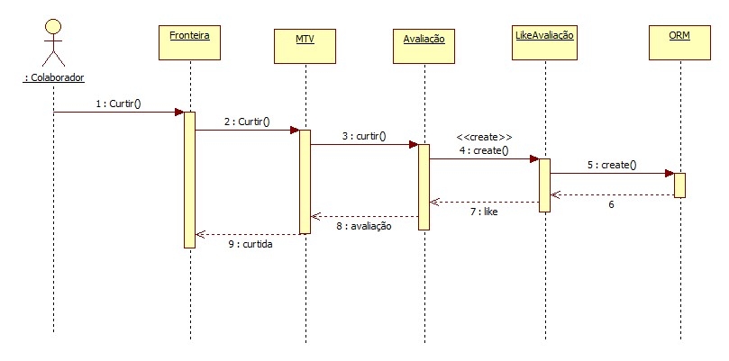

## Comentar Avaliação
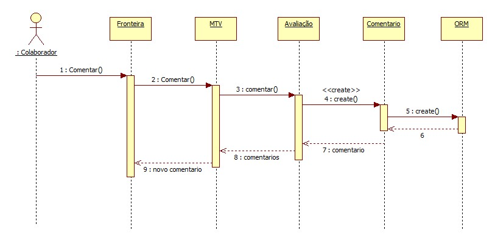

## Ver Avaliações Itens
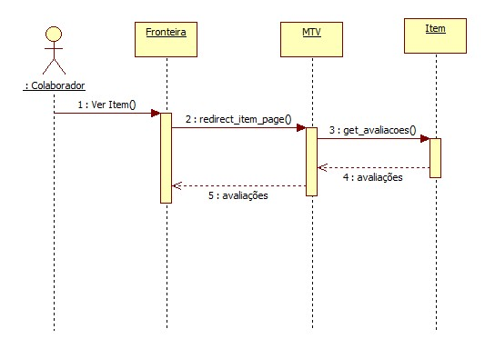

## Ver Avaliações Membros
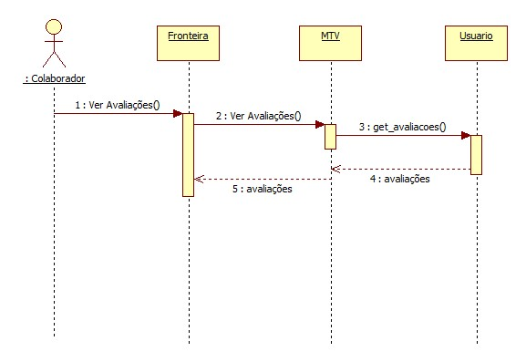

## Ver Detalhes Itens
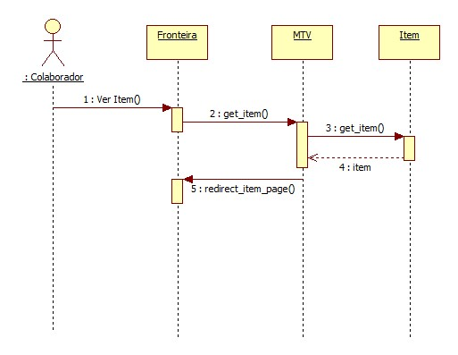

&nbsp;
# 6- Diagrama de Classes

&nbsp;

# 7- Diagrama de Domínio
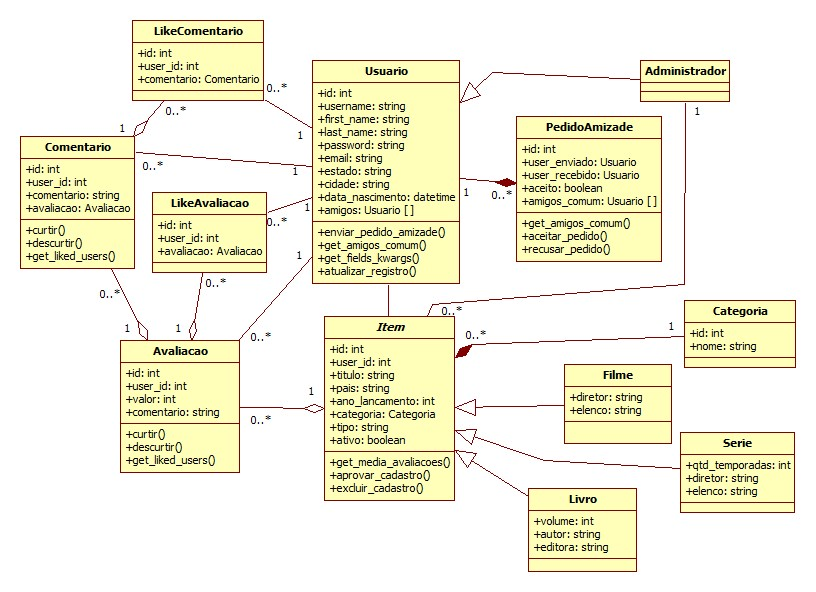
