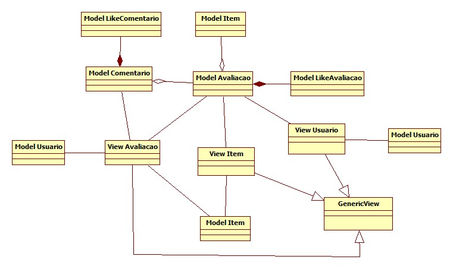
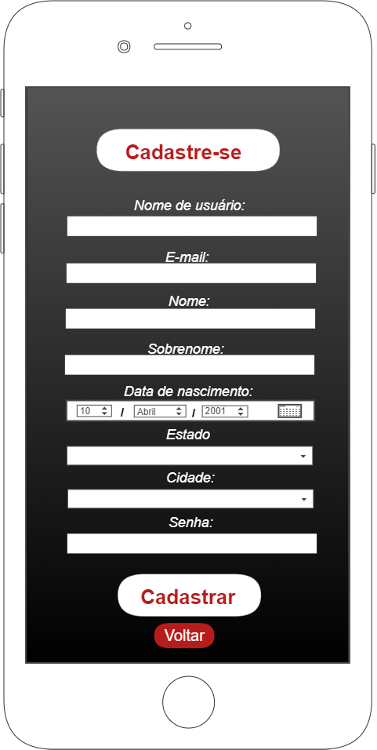
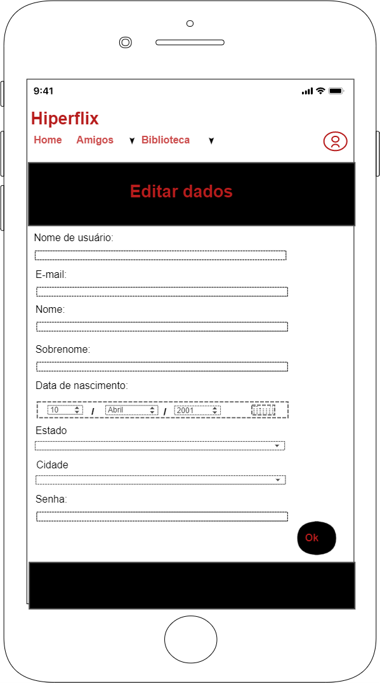
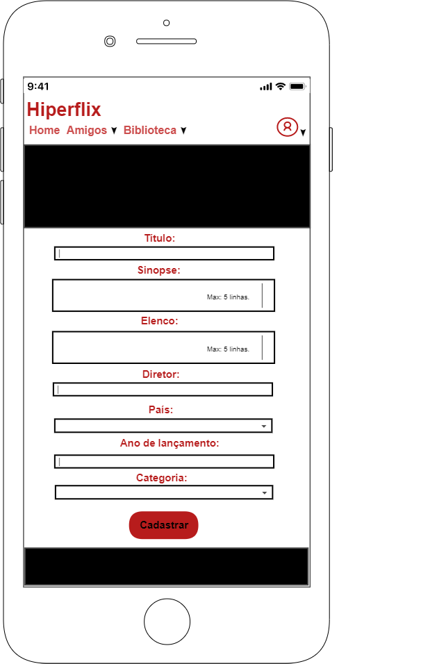
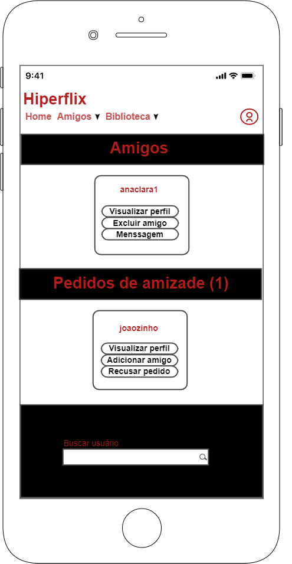
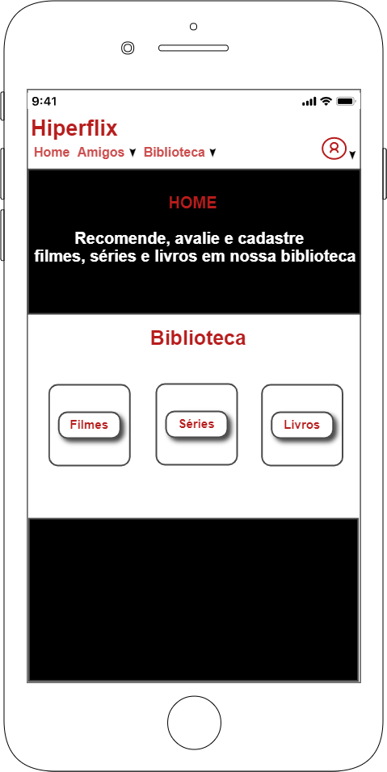
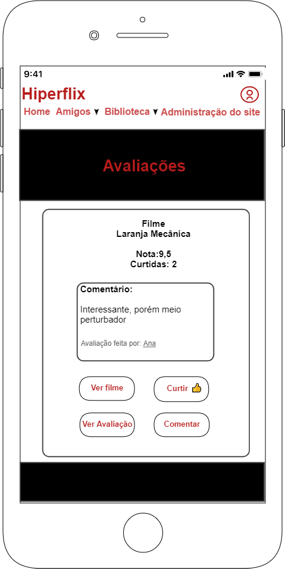
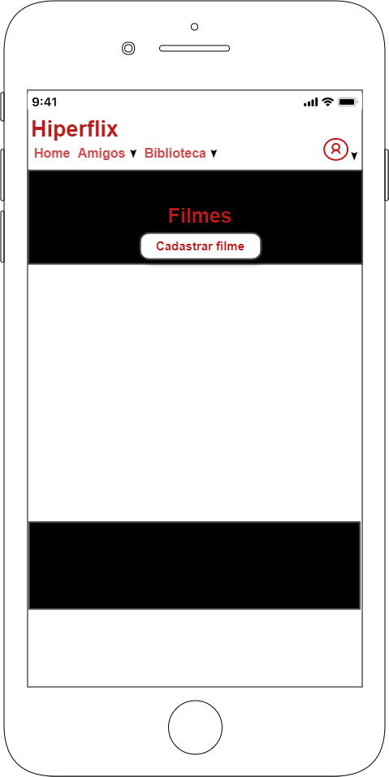
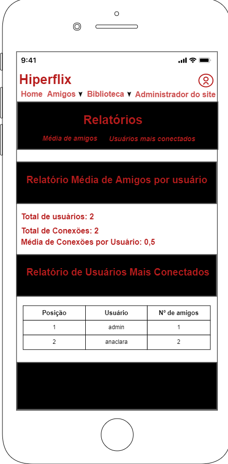
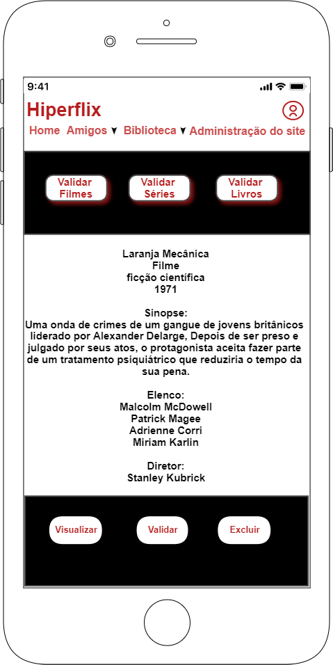

# HiperFlix

# Especificação de requisitos
## PROJETO: Aplicativo para Recomendação de Filmes, Séries e Livros
### Curso de Sistemas de Informação
### Prática Profissional em Análise e Desenvolvimento de Sistemas
### Turma 05K
### 1º semestre de 2021

              UNIVERSIDADE PRESBITERIANA MACKENZIE
                      
              FACULDADE DE COMPUTAÇÃO E INFORMÁTICA

                          LETHICIA MARQUEZINI
                     JOAO PEDRO FRANCA DE OLIVEIRA

          Aplicativo para Recomendação de Filmes, Séries e Livros 
                            
                               HiperFlix

                                SÃO PAULO
                                  2021

# 1- Introdução

O presente projeto em questão foi desenvolvido com o intuito de desenvolver uma aplicação de recomendação de filmes, livros e séries. A ideia principal é que seja utilizado por uma empresa e seus colaboradores visando a promoção do desenvolvimento social, do engajamento e da sinergia entre os indivíduos e suas clusterizações dentro da instituição como um todo. O sistema utilizará os insumos gerados pelos próprios usuários para auxiliar nas avaliações, na recomendação de itens de maneira intuitiva e automática.

# 2- Requisitos do Sistema

### 2.1- Requisitos Funcionais

RF1	- O sistema deverá permitir que o colaborador da empresa faça um cadastro.

RF2	- O sistema deverá permitir que o colaborador possa atualizar as informações de cadastro.

RF3 -  O sistema deverá permitir que qualquer membro possa cadastrar novo item (livro, filme ou série).

RF4	- O sistema deverá permitir que o administrador possa validar os novos itens cadastrados.

RF5	- O sistema deverá permitir que os membros possam avaliar os itens.

RF6 - O sistema deverá permitir a pesquisa de outros membros.

RF7 - O sistema deverá permitir que os membros possam enviar solicitações de amizade para outros membros.

RF8 - O sistema deverá permitir que os membros possam aceitar ou recusar solicitações de amizade de outros membros.

RF9 - O sistema deverá permitir que os membros possam reagir ou retirar a reação nas avaliações.

RF10 - O sistema deverá permitir a visualização de amigos em comum entre os membros.

RF11 - O sistema deverá disponibilizar uma página de análise de dados para os gerentes do serviço.

### 2.2- Requisitos não Funcionais

RNF1 - O sistema poderá ser acessado web através de navegador.

RNF2 - O sistema deverá ser responsivo e leve para carregamento das funções.

RNF3 - Os dados devem ser armazenados em uma base de dados, podendo ser relacional ou NoSQL

RNF4 - Aplicação deve ser implementada em um provedor de serviços na internet.

RNF5 - O sistema não pode demorar mais do que 5 segundos para carregar uma página.

RNF6 - A disponibilidade da aplicação deverá atender o padrão 99.99%, em regime 24x7

RNF7 - A documentação do sistema deverá apresentar indicativos de segurança dos dados cadastrais e transacionais para evitar possíveis invasões ao site.

# 3- Casos de uso
## 3.1- Diagrama de casos de uso

## 3.2- Especificações dos casos de uso

# 5- Diagramas de Sequencias

## Fazer Login

## Cadastrar Usuario

## Atualizar Cadastro

## Propor Amizade

## Cadastrar Item

## Validar Item

## Solicitar Relatório

## Avaliar Item

## Curtir Avaliação

## Comentar Avaliação

## Ver Avaliações Itens

## Ver Avaliações Membros

## Ver Detalhes Itens

# 6- Diagrama de Domínio

&nbsp;

# 7- Diagrama de Classes

# 8 - Diagrama de Navegação

# 9 - Wireframes
### 1. Tela de Login

### 2. Tela de Cadastro de Usuário

### 3. Atualizar Cadastro

### 4. Cadastro de Item

### 5. Tela de Amigos

### 6. Tela Principal

### 7. Ver Avaliações dos Itens / Usuários

### 8. Curtir / Comentar Avaliação

### 9. Tela dos Itens na Biblioteca

### 10. Tela dos Relatórios

### 11. Tela da Validação de Itens

